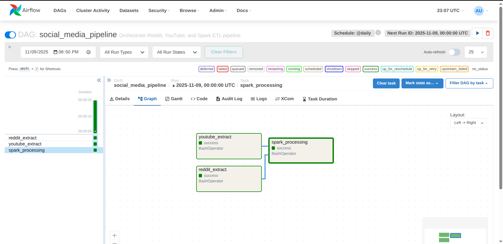
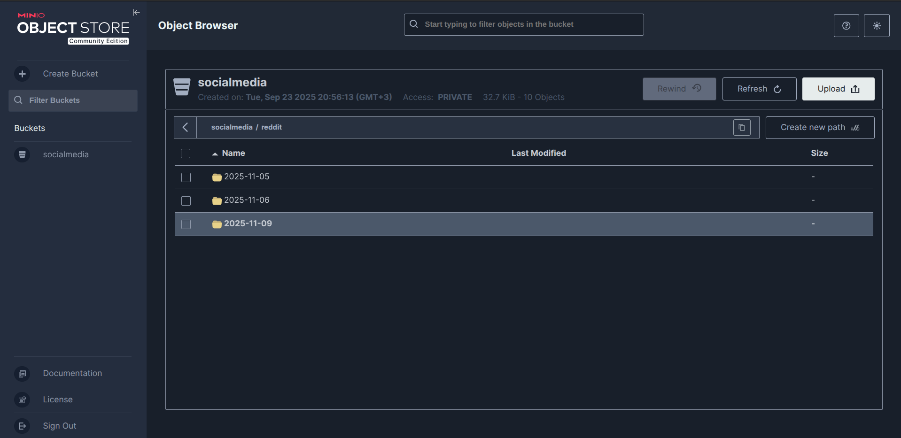

# 🚀 Social Media Analytics Pipeline – Medallion Architecture  

---

### 🏗️ Architecture 🔥

## 🌟 **Project Overview**  

**📊 Real-Time Social Media Insights with Airflow & MinIO! 📊**  
*🔥 Built in November 2025, this project collects, processes, and visualizes social media data from Reddit and YouTube, using Airflow for orchestration, PySpark for transformations, and MinIO for scalable object storage.*  

This project is a **Data Engineering Showcase (Nov 2025)**, constructing a robust data pipeline for social media analytics. Data is ingested via APIs, stored in MinIO, transformed in a medallion architecture (Bronze → Silver → Gold), and exposed for further analytics. Airflow orchestrates the end-to-end pipeline, ensuring reliable scheduling and retries.  

---

## 📈 **Key Features** 💡  

### 🎯 Medallion Architecture
- **Bronze Layer**: Raw data ingestion from APIs (Reddit, YouTube) stored in MinIO (S3-compatible storage).
- **Silver Layer**: Cleaned and transformed data using PySpark.
- **Gold Layer**: Aggregated and enriched data stored in **PostgreSQL** for analytics and reporting.

### 🔌 Data Pipeline
- Orchestrated via **Airflow DAGs** with task dependencies.
- Incremental processing with **state files** to track processed content.
- Python scripts handle extraction, transformation, and MinIO uploads.

### 🌠 Visualization
- Output files stored in MinIO for downstream analytics.
- Can be connected to dashboards or BI tools for social media metrics.
- Supports YouTube video metrics, Reddit post trends, and time-based aggregations.

### ⚡ Performance & Scalability
- MinIO provides high-performance object storage for large datasets.
- PySpark ensures scalable processing.
- Airflow DAGs allow parallelism and task retries.

---

## 📷 **Visual Results**  

*Overview of the Bronze, Silver, and Gold layers in the data pipeline.*

### Airflow DAG Snapshot
  
*Visual representation of the Reddit and YouTube extraction DAG.*

### MinIO Bucket Structure
  
*Shows how raw and processed data are stored.*

### Data Pipeline Execution Logs
  
*Example of task execution and successful uploads.*

---

## 🚀 **Technical Highlights**  

### ⚡ Robust Data Pipeline
- **Airflow DAGs**: Orchestrates extraction from APIs, transformation, and MinIO upload.
- **Python Scripts**: Separate scripts for Reddit (`reddit.py`) and YouTube (`youtube.py`) processing.
- **State Management**: Tracks processed items to enable incremental ingestion.

### 🛡️ Data Integrity & Optimization
- **PySpark Transformations**: Deduplication, enrichment, and aggregation.
- **MinIO Storage**: Ensures persistent and reliable storage.
- **Idempotent Tasks**: Safe reruns with state handling.

### 🌍 Tools & Technologies
- **Airflow**: Orchestration and scheduling.
- **Python & PySpark**: Data extraction and transformations.
- **MinIO**: Object storage for raw and processed datasets.
- **Reddit & YouTube APIs**: Source of social media data.
-  **PostgreSQL**: Storage of the results so any BI tool could connect on it.

---

## 🎨 **Workflow Diagram**

## 🌐 Project Structure & Usage
- python Folder: Contains all processing scripts
- reddit.py: Extract and transform Reddit data.
- youtube.py: Extract and transform YouTube data.
- social_media_processing.py: Shared transformations.
- states/: Tracks processed items (reddit_state.json, youtube_state.json).
- requirements.txt: Python dependencies.
- images Folder: Contains project screenshots
  - airflow_dag.png: DAG visualization in Airflow.
  - minio_bucket_structure.png: MinIO storage layout.
  - pipeline_logs.png: Example logs from task execution.
